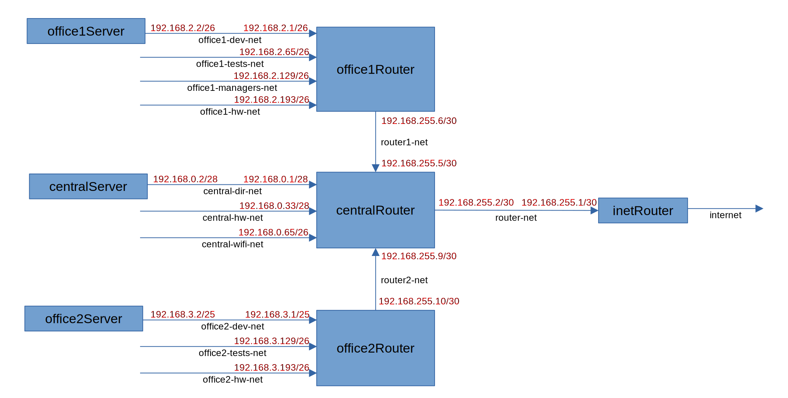
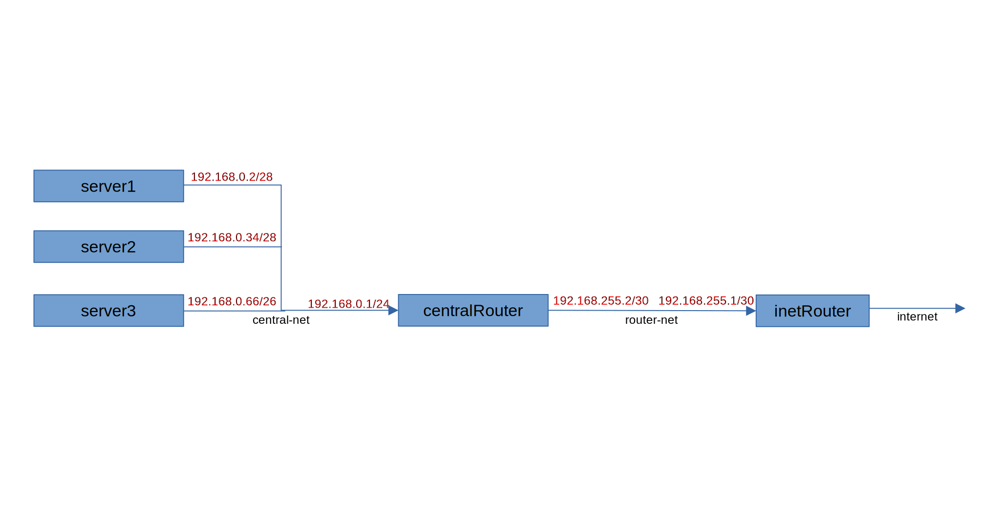

## Теоретическая часть ##

Начальный адрес диапазона адресов сети является ее собственным адресом. По адресу сети и маске узел, отправляющий сообщение, определяет, принадлежит ли его сети адрес получателя сообщения, и выбирает нужный маршрут. Узлам адрес сети не назначается.  
Также узлам не назначается последний адрес диапазона, это широковещательный (broadcast) адрес, сообщения с таким адресом принимают и обрабатывают все узлы данной сети.  
Таким образом, количество доступных для назначения узлам адресов в сети меньше общего количества адресов на 2, диапазон "начальный адрес"-"конечный адрес" включительно. Исключение - сеть с маской 255.255.255.254. Весь диапазон адресов узлов в такой сети состоит из значений .0 и .1. Такие сети применяются, когда нужно соединить только два узла, и точно известно, что других узлов в сети не будет, например, для связи с провайдером.  

Группа сетей "office1" представляет собой разбиение без остатка более крупной сети 192.168.2.0/24 (256 адресов) на 4 равных по размеру диапазона по 64 адреса в каждом.  
```
                 192.168.2.0/26 192.168.2.64/26 192.168.2.128/26 192.168.2.192/26
                |--------------|---------------|----------------|----------------|
 всего адресов    64              64              64               64
 всего узлов      62              62              62               62
 адрес сети       .0             .64            .128             .192
 начальный адрес  .1             .65            .129             .193
 конечный адрес  .62            .126            .190             .254
 broadcast       .63            .127            .191             .255
```
Группа сетей "office2" также получена разбиением на диапазоны более крупной сети 192.168.3.0/24 (256 адресов). Диапазоны не равные по размеру, остатка нет. Адрес сети я изменил на 192.168.3.0 для исключения пересечения с домашней сетью.  
```
                          192.168.3.0/25          192.168.3.128/26 192.168.3.192/26
                |--------------------------------|----------------|----------------|
 всего адресов    128                               64               64
 всего узлов      126                               62               62
 адрес сети        .0                             .128             .192
 начальный адрес   .1                             .129             .193
 конечный адрес  .126                             .190             .254
 broadcast       .127                             .191             .255
```
Группа сетей "central" - результат разбиения на диапазоны сети 192.168.0.0/25 (128 адресов) (которая в свою очередь является первой половиной сети 192.168.0.0/24), 4 "куска" по 16 адресов и "остаток" 64 адреса. Два диапазона не задействованы, соответствуют сетям 192.168.0.16/28 и 192.168.0.48/28. Ошибок в разбиении нет, сети не пересекаются, возможно это резерв на будущее. К тому же пропуски можно ликвидировать, преобразовав имеющиеся сети 192.168.0.0/28 и 192.168.0.32/28 (по 16 адресов) в 192.168.0.0/27 и 192.168.0.32/27 (по 32 адреса). На практике все же рекомендуется выделять диапазоны без пропусков.  
```
                 192.168.0.0/28           192.168.0.32/28           192.168.0.64/26
                |--------------|. . . . .|---------------|. . . . .|---------------|
 всего адресов    16             16        16              16         64
 всего узлов      14             14        14              14         62
 адрес сети       .0            .16       .32             .48        .64
 начальный адрес  .1            .17       .33             .49        .65
 конечный адрес  .14            .30       .46             .62       .126
 broadcast       .15            .31       .47             .63       .127
```

## Практическая часть ##

Схема собранного стенда представлена на рисунке:  


Связь между роутерами организована сетями по 4 адреса в каждой, из которых крайние адреса не используются для назначения узлам (адрес сети и широковещательный адрес). Как раз здесь и можно применить сеть с маской 255.255.255.254. Промышленные шлюзы умеют работать с такими сетями, CentOS нет.  
Каждой сети на узлах назначен отдельный интерфейс. Все серверы и роутеры видят друг друга, а также имеют доступ в интернет.  
При отладке стенда обнаружено, что после перезагрузки сети на узлах (systemctl restart network) не всегда применяются сделанные изменения (новый дефолтный шлюз, дополнительные маршруты). Причины сбоя я не понял, поэтому в скрипты введен цикл for, в котором проверяется успешность применения новых настроек, и при необходимости сеть перезапускается повторно.  
На лекции преподаватель высказал пожелание, чтобы студенты применили для сборки и настройки стенда Ansible. До поступления на курс я никогда с Ansible не работал, двух лекций по основам технологии однозначно мало, чтобы решить задачу, поэтому ограничился vagrant-файлом.  


## Частный случай построения сети ##

В задании есть фраза "_при нехватке сетевых интерфейсов добавить по несколько адресов на интерфейс_". Смысла этой фразы не понял. На одном интерфейсе невозможно прописать несколько _разных_ сетей, можно только назначить ему несколько адресов из одной сети.  
Однако на одном интерфейсе можно задать сеть, включающую в себя несколько мелких сетей. Пример такого стенда представлен на рисунке:  


На интерфейсе центрального роутера "central-net" назначена сеть с маской 255.255.255.0, которая включает в себя сети всех подключенных серверов. Адрес интерфейса назначен дефолтным шлюзом на серверах. Стенд, построенный по данной схеме, представлен vagrant-файлом в папке special_case. Стенд рабочий, серверы и роутеры видят друг друга и имеют доступ в интернет.  
Интересно поведение роутера в такой схеме, см. файл result.txt. Проверка выполнялась с сервера server3 (192.168.0.66/26).  
При пинге узла server1 (192.168.0.2/28) server3 понимает, что server1 находится в другой, отличной от его собственной, сети. Поэтому он отправляет пакет на дефолтный шлюз (centralRouter), указывая в качестве МАС-адреса получателя МАС-адрес интерфейса роутера 192.168.0.1/24.  
Реакция роутера на первый пакет выглядит как удивление - "адрес получателя в твоей же сети, зачем ты прислал пакет мне?". С точки зрения роутера оба адреса - отправителя и получателя - действительно находятся в одной сети из-за маски /24. Но поскольку получателем пакета указан роутер, он вынужден обработать его. Поэтому роутер пересылает пакет на тот же интерфейс на адрес получателя, а отправителю возвращает уведомление о пересылке "Redirect Host", отсюда и "+1 errors" в статистике.  
Повторный пинг того же узла затруднений уже не вызывает. Роутер запоминает из предыдущего сеанса МАС-адреса обоих узлов, и в дальнейшем обмен между ними ведет не задумываясь. Здесь, по-видимому, работает механизм коммутации.  
Как точно выглядит механика обмена в такой сети, не могу сказать, высказал предположения.  
Практического смысла такая схема не имеет, т.к. отсутствует изоляция широковещательного трафика сетей серверов, невозможно централизованно выдавать адреса разным сетям с dhcp-сервера, находящегося за центральным роутером.

