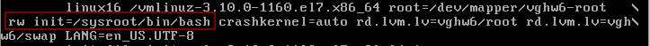

**1. Попасть в систему без пароля несколькими способами**
=========================================================

Собственно, попасть в систему без какого-либо пароля можно только одним способом – загрузиться в однопользовательском режиме (single user mode). При этом в память загружается только образ initrd с минимально необходимым функционалом, монтируются в режиме "только чтение" локальные файловые системы (как минимум корневая), но сетевые интерфейсы неактивны, и в системе может работать только один пользователь root.  
При использовании загрузчика GRUB это достигается правкой меню загрузки. Если меню загрузки не отображается (например, установлен параметр GRUB_TIMEOUT=0), то надо удерживать Shift при загрузке. В меню следует выбрать нужный пункт загрузки и нажать ‘e’:  

Изменения вносятся в выделенную строку (linux16 для RHEL/CentOS 7, linux для RHEL/CentOS 8):  

Сделанные таким образом изменения однократные, применяются только при данной загрузке. Далее возможны три варианта.
  
  
  
### **init=/bin/bash (/bin/sh)** ###
Это классический однопользовательский режим. Для его активации нужно дописать запуск оболочки в строку, можно удалить “rhgb quiet”, чтобы видеть процесс загрузки. Файловую систему root можно сразу смонтировать в режиме rw, заменив ro:  

По окончании загрузки получаем:  

Теперь можно штатными средствами задать новый пароль для рута. Перед перезагрузкой нужно создать файл /.autorelabel – указание для системы SELinux принять изменения:  

  
  
  
### **rd.break** ###
Система загружается в “аварийном режиме” (emergency mode). Нужно дописать в строку rd.break:  

По окончании загрузки корневая файловая система смонтирована в каталоге /sysroot в режиме “только чтение”. Перемонтируем в режим записи, входим “внутрь” ФС (chroot), выполняем необходимые действия, создаем “внутри” файл /.autorelabel и перезагружаемся:  

### **rw init=/sysroot/bin/bash** ###
Заменяем параметр ro на указанную строку:  

Рутовая файловая система смонтирована в режиме rw. Действия аналогично методу 2:

  
  
  
2. Установить систему с LVM, после чего переименовать VG.

Система установлена на логических томах LVM, имя Volume Group vghw6:
(10)
Переименовываем VG, меняем старое название на новое в указанных файлах (опция -i позволяет сохранить исходную версию в файле с суффиксом .sav), пересоздаем initrd с новым именем VG:
(11)
После перезагрузки видим новое имя VG:
(12)

3. Добавить модуль в initrd.

Создаем указанный каталог, в него помещаем файлы module-setup.sh и test.sh:
(13)
Текст скрипта module-setup.sh, который устанавливает модуль и вызывает скрипт test.sh:
(14)
(15)
Текст скрипта test.sh, при выполнении которого на экране в течение 30 секунд отображается геометрический рисунок:
(16)
Пересоздаем initrd, чтобы модуль добавился в образ, из-за малого размера экрана лог работы сохраняем в файл log:
(17)
Просмотр лога (less log) показал, что ошибок нет, модуль добавился успешно.
Чтобы при загрузке увидеть работу модуля, в меню загрузки boot/grub2/grub.cfg из нужного пункта удаляем “rhgb quiet”:
(18)
В ходе перезагрузки модуль отработал успешно:
(19)

